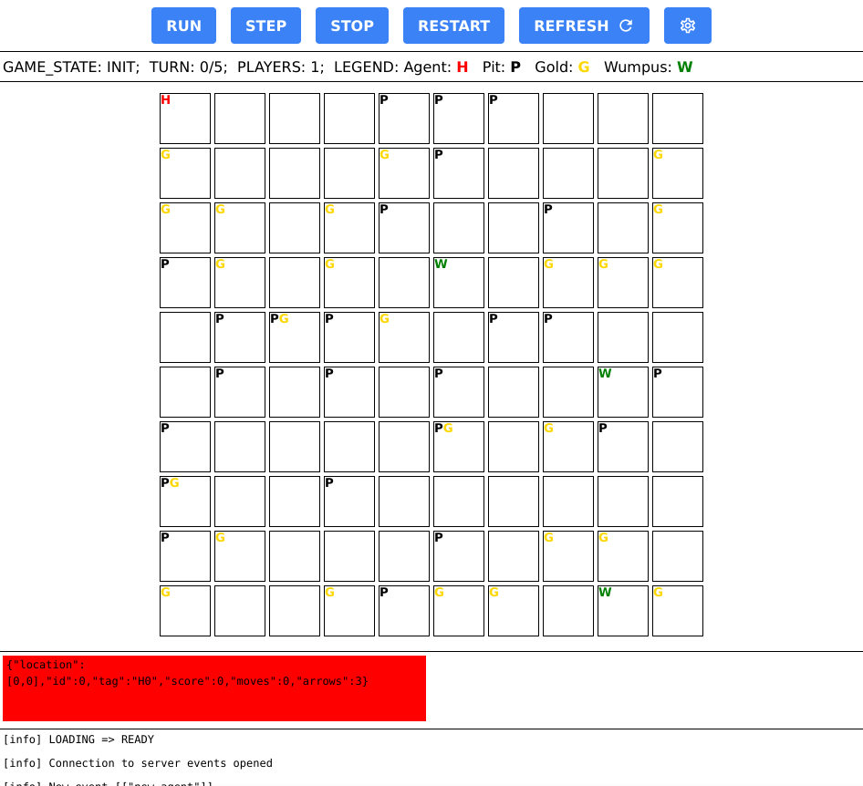

# OVERVIEW
Mono-repo for wumpus world game-server, web-viewer, and sample agents. Not meant for non-cooperative envs as it's easy to cheat. Just for local testing.

---



---

# USAGE
Install:

```
./install.sh
```

Run dev:

```
npm run dev
```

Run prod:

```
npm run web-build-cp
npm run api-start
```
